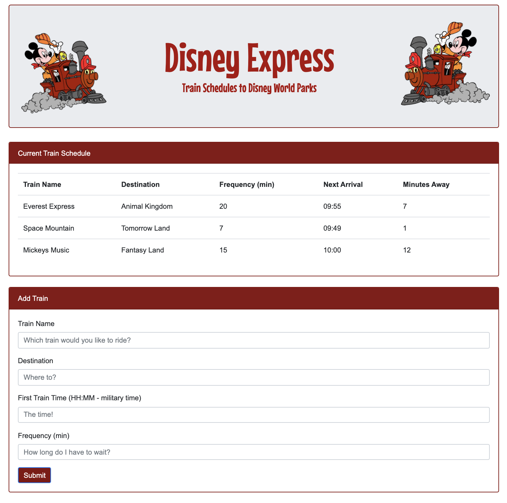

# Train_Activity_Basic

The Train Scheduler is set up to enable user to type in submit train information to calculate when the next train will arrive; relative to the curretn time.

Add Train Secion:

- Train Name
- Destination
- First Train Time (hh:mm - military time)
- Frequency

Train Scheduler Theme:
Disney Express
Trains to the Disney World Parks

https://melaniebott2691.github.io/Train_Activity_Basic/

Assignment built with:

- Firebase Database
- HTML
- Bootstrap
- CSS
- JavaScript
- Moment.js

